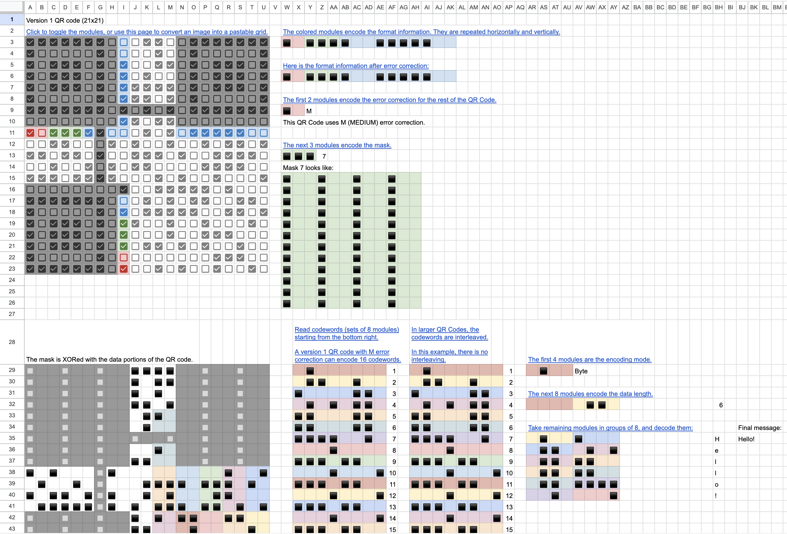
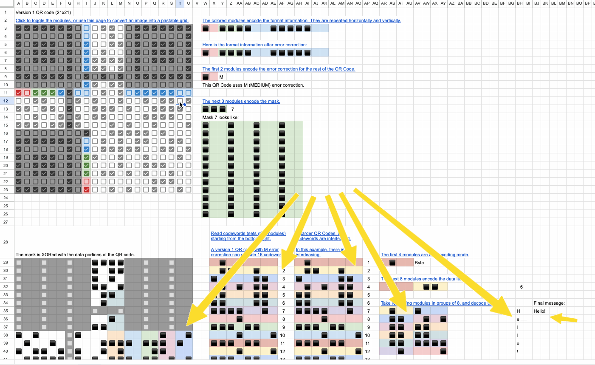
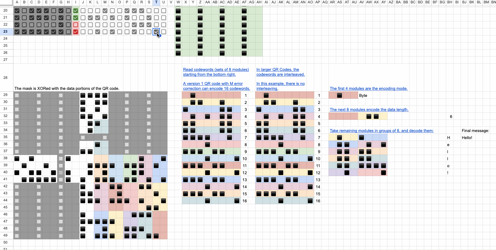

QR Code decoder in Google Sheets
================================

A QR Code decoder implemented in Google Sheets: [Google Sheet link](https://docs.google.com/spreadsheets/d/1VcKjPQZmkpJPoo1CtD7yLXA9FAob_F9NqnFDD9MZqqA).

Each step of the decoding process is implemented with Google Sheet formulas.
Toggling the modules of the input QR Code will automatically update intermediate steps and final output message:

More "drastic" input changes are supported too, such as toggling one of the encoding mode modules:

