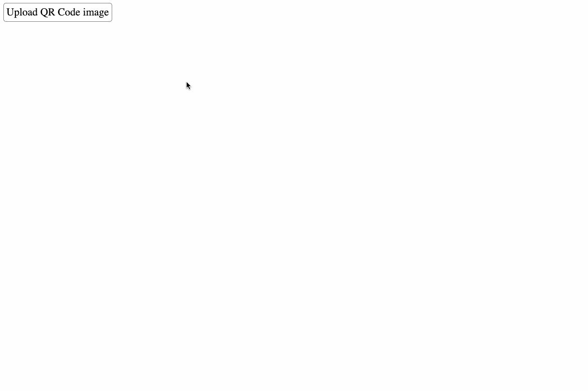

# QR Code decoder in Google Sheets

A QR Code decoder implemented in Google Sheets: [Google Sheet link](https://docs.google.com/spreadsheets/d/1VcKjPQZmkpJPoo1CtD7yLXA9FAob_F9NqnFDD9MZqqA).

Each step of the decoding process is implemented with Google Sheet formulas.
Changing the modules of the input QR Code will automatically update intermediate steps and final output message:

More "drastic" input changes are supported too, such as changing the encoding mode modules:

This also comes with a tool to convert an image of a QR code into a binary matrix that can be pasted into the Google Sheet:

